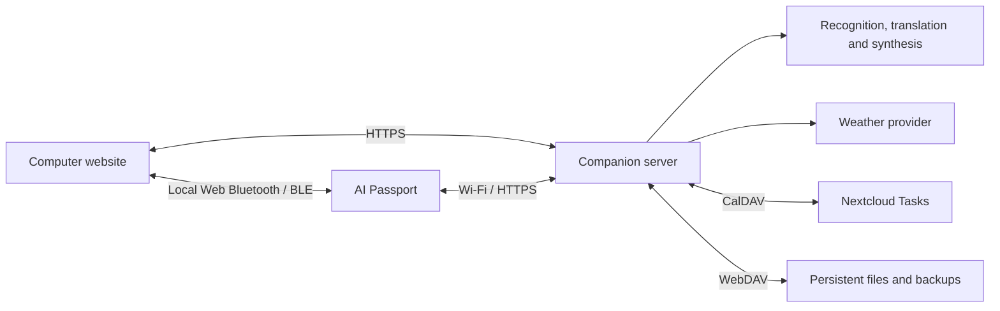

[简体中文](passport-suite-plan.zh_CN.md) · **English**

# AI Passport Integrated Firmware Plan

Updated: 2026-10-05, Asia/Shanghai. Status: scope revised to the user's latest requirements; technical proposals remain design drafts. Application implementation has not started.

The target is one firmware application with five features and an online management website accessed from a computer. The computer connects to the nearby device over Bluetooth; the device uses its own Wi-Fi for server and online-service access. Daily use does not require a phone, phone application, hotspot, or phone provisioning.

The user determines scope and acceptance. Codex prepares requirements, architecture, reviews and validation; OpenCode codes authorized implementation stages. Engineering follows [AGENTS.md](../../AGENTS.md) and the [AI development guide](../development/ai-guide.md).

## 1 Current feature scope

| Original item | Revised feature | Agreed disposition |
| --- | --- | --- |
| 1 | Voice translation | Retained for continued detailed design; Chinese ↔ English initially; speech/AI provider pending |
| 2 | OTP authenticator | Retained for continued detailed design; remove the requirement to design it last |
| 3, 7 | Ticket wallet, including railway information | One application for train, flight, performance and other ticket details and original valid QR codes; remove station boards and departures without a ticket |
| 4 | Nextcloud tasks | Actual task-list connection, reading and device display required; device list reading and completion required; creation excluded from current scope |
| 8 | Three-body clock and weather | Retained; becomes the default home when complete |
| 5, 6, 9, 10, 11, 12 | Quota display, coding assistant control, travel guide, China check-ins, QQ Music and presentation remote | Cancelled entirely, with no deferred milestones or placeholder entries |

Remove route generation, attraction narration, province packs, national maps, stamps, footprints, achievements and wishes. Their resources, schemas, APIs, milestones and acceptance no longer belong to this product. The wallet does not become a guide or check-in application. FIDO2, Passkey, U2F, password vaults and SSH signing remain excluded.

## 2 Connections and responsibilities

| Channel | Proposed purpose |
| --- | --- |
| Computer browser to device BLE | Initial Wi-Fi provisioning, binding, small settings and status; OTP import requires a separate protected session rather than ordinary settings-write permission |
| Device Wi-Fi to server | Tickets, Nextcloud tasks, weather, time synchronization, translation audio and results; the computer need not remain on |
| Browser to server | Ticket import/review, task connection, translation languages/providers, device management and backup status |

The browsing computer connects to a nearby device; the remote website server cannot directly access the user's Bluetooth device. Serve the website over HTTPS and request device permission after a user click. The computer needs usable Bluetooth and a browser supporting Web Bluetooth. [Chrome's official guidance](https://developer.chrome.com/docs/capabilities/bluetooth) describes platform differences; Linux may require experimental settings. Test the actual computer, OS, browser version and reconnection before defining supported platforms. Do not assume universal browser support.

The proposal uses browser BLE GATT sessions; existing BLUFI examples are not a ready website client. Define service UUIDs, fragmentation, size limits, acknowledgements, timeouts, cancellation and compatibility. Provisioning opens only after physical confirmation for a limited time. Authenticate and protect sensitive configuration; names, UUIDs and browser permission alone do not authenticate a device. Wrong passwords, disconnections and cancellation preserve previous working configuration. Verify server identity before binding and support credential revocation. Do not disable certificate validation to bootstrap time.

Follow the [ESP-IDF 5.5.3 coexistence guidance](https://docs.espressif.com/projects/esp-idf/en/v5.5.3/esp32c3/api-guides/coexist.html). Proposed scheduling closes BLE after setup or enables it for limited sessions and avoids simultaneous large downloads and speech. These strategies need measurement, not throughput or memory assumptions. If browser BLE is unavailable, review another computer provisioning route without introducing a phone dependency.

Retain server WebDAV persistence and backup, reduced to tickets, settings, task caches and separately encrypted OTP backups. Remove cancelled-feature data. Nextcloud tasks use CalDAV; file backup through WebDAV is not a task protocol. Configure service addresses and credentials privately at runtime.

## 3 Ticket wallet with railway information

The website supports manual entry and pasted text, with screenshot/file recognition assessed later. Review uncertain fields before publication; OCR is not an implemented first-release capability. Device screens include a chronological list, ticket details and a separate code page. Fully downloaded tickets remain viewable offline.

| Ticket type | Required display when supplied by the source |
| --- | --- |
| Train | Travel date, train number, boarding/arrival stations, departure/arrival times, carriage, seat or standing status, class; distinguish the passenger's boarding station from the train origin |
| Flight/boarding pass | Date, flight, departure/arrival airports and terminals, departure/arrival times, seat; show gates and boarding times only with source and freshness information |
| Performance | Event, venue, session date/time, section, row and seat; explicitly identify standing tickets |
| Other | Name, type, validity, venue/address, admission notes, supplied seating and QR/barcode |

Common fields include stable ID, revision, timezone, type, provenance, review state, last update, missing-field reasons and code availability. Cross-midnight and cross-timezone values carry full dates. Do not fabricate seats, stations or gates from defaults.

Remove station boards, full-station departures, live boarding status and board-source investigations. Intermediate stops, dwell times and train models from the old plan are not required acceptance in the new scope; reconsider separately if needed. Reliable personal ticket details do not depend on a live railway API.

Display only issuer-provided original code payloads or verified images. Do not synthesize admission codes from order numbers, seats or train numbers. Railway details do not replace identification or official travel credentials. Cache valid static QR/barcodes; assess issuer rules for dynamic, short-lived or identity-bound codes before promising offline admission. Without a valid code, explain why while retaining details.

Preserve quiet zones, integer scaling and screen safe bounds, and stop unrelated animation on code pages. Verify real-device scanning and issuer rules. Browsing or showing a code does not automatically mark redemption. Separate record deletion from cache removal; failed synchronization preserves usable tickets.

## 4 Voice translation

Propose an explicit translation page, source/target language selection, button-triggered short recording, submission, translated text and optional synthesized playback. Source-language detection, quick bidirectional switching and history retention need review. The first release supports Chinese ↔ English translation in both directions. Providers remain undecided; other languages are outside the first release.

The device sends bounded audio to the server over its own Wi-Fi; the server adapts recognition, translation and synthesis providers without a phone relay. Explain that new translations are unavailable offline; no complete local recognition or translation model is promised. Recording, requests and playback support cancellation and clear timeout/failure states, without automatic continuous recording.

Detailed design determines recording limits, formats, streaming buffers, text limits, playback, cost and audio retention. Separate source text from translation and verify script coverage and Chinese fonts before enabling languages. Recording gestures must not conflict with Back.

## 5 OTP authenticator

Start detailed design now rather than waiting for other features. Propose TOTP first; confirm algorithms, digits, periods and any HOTP need against actual accounts. Generate codes locally for ordinary offline use. Explain uncertain time and require synchronization rather than presenting unreliable codes as valid.

Propose browser-local parsing of OTP URIs or QR codes, review issuer/account/algorithm parameters, then import through protected BLE with physical confirmation. Avoid third-party scripts on the import page and do not upload plaintext seeds to the server by default. Define device authentication, transfer confidentiality and temporary browser-data cleanup.

Determine unlocking, idle lock, seed storage, clock drift, encrypted backup, recovery, deletion and upgrade preservation before using real seeds. Separately encrypted OTP backups may use WebDAV but never ordinary ticket exports. Recovery material must exist outside the device; backup access must not depend solely on its OTP. Validate with public test vectors and fictional accounts; keep real seeds out of source, logs, screenshots and fixtures. Hardware security and eFuse writes require separate review.

## 6 Nextcloud tasks

Actual connection is required, not a fixture-only list. The server stores connection configuration, discovers task-capable collections through CalDAV and synchronizes bounded lists to the device. [Nextcloud Tasks' official documentation](https://github.com/nextcloud/tasks) lists CalDAV synchronization and ETag conflict requirements.

Required behavior includes list selection, titles, completion status, due dates and available notes, last-sync time, manual refresh, empty state, authentication failure and stale-cache state. Keep downloaded tasks offline with cache labels. Distinguish server connection from device download. Handle date-only values, timezones, no due date and long text. Verify recurring tasks, subtasks and shared-list compatibility against the actual Nextcloud version.

Device completion is required: select a task, confirm explicitly, persist the operation and show pending, success or failure. Persist offline operations for retry after reboot. Define UID identity, conditional ETag updates, retry idempotency and conflict screens without overwriting newer website edits. Reopening requires separate confirmation; task creation and voice creation are outside current scope.

## 7 Three-body clock, weather and controls

When complete, the clock becomes the boot home with a three-body-inspired animated scene, date, time, selected-city weather and launcher access. Use bounded procedural rendering. Indicate uncertain time and stale weather independently. Weather failure does not block local time or other features. Configure the city from the computer website; fonts, frame rate, sleep and power consumption require device validation.

The launcher contains translation, OTP, wallet, tasks and settings/synchronization only. Settings cover provisioning, binding, city, languages and device state without cancelled-feature entries. Design a new UI rather than reuse the baseline test menu or demo shell.

Use UP, DOWN and OK without simultaneous chords. Lists move with UP/DOWN and open with OK; propose long OK for an action menu including Back. Define separate recording gestures and OK returning from codes to details. Detailed PRDs specify press, hold, release, cancellation and Back on every screen. Keep button callbacks nonblocking, lock cross-task LVGL access and stop UI-accessing tasks/callbacks before deleting screens.

## 8 Resources, synchronization and preservation

The target remains ESP32-C3, 8 MB Flash, no PSRAM and ESP-IDF 5.5.3. Remove province, narration and map budgets. The old D1 5 MiB application and dual resource-slot layout no longer governs storage. Measure firmware, fonts, ticket-code caches, audio buffers and BLE/Wi-Fi/TLS peaks before defining application partitions. Keep upstream default partitions minimal.

Activate complete validated ticket/cache revisions and preserve old ones on failure. Bound imports, network responses, codes and audio; avoid whole-file RAM buffering. The server acknowledges only after reliable local record/queue persistence. Distinguish device-local save, server receipt and WebDAV backup completion. Support fresh-instance recovery with a separate confidential OTP flow. Define preservation during flashing when implementing.

## 9 Further design and acceptance

The 2026-10-05 [suite PRD](passport-suite-prd.md), [suite contract](passport-suite-contract.md) and [stage prompts](passport-suite-prompts.md) now expand this scope into pages, protocols and replacement tasks. Their SU/SC/ST/SA identifiers govern new work; the table below is a work-block overview, not a second task order. Detailed translation and OTP designs are delivered together; their implementation depends on their own gates, not on an OTP-last rule.

This is a proposed work order, not a schedule or coding authorization. Translation and OTP detailed design can begin now without the former travel milestones.

| Work block | Design deliverables | Acceptance focus |
| --- | --- | --- |
| Connection foundation | Computer browser matrix, secure BLE, provisioning/binding, Wi-Fi HTTPS, time and resource budgets | Actual computer provisioning; wrong password, permission denial, timeout, disconnect, reconnect, coexistence and reboot |
| Five-feature detailed design | Screens/keys, languages/providers, OTP security, ticket fields and task reading/completion protocols | All five features covered, with cancelled entries/dependencies absent |
| Wallet and tasks | Import review, ticket synchronization, real CalDAV and offline cache | Train/flight/performance missing fields and midnight; scanning; actual task reading, completion, offline retries and concurrent conflicts |
| Clock and weather | Default home, provider, city and time states | Boot home, stale weather, prolonged operation and power |
| Translation | Bounded recording, recognition/translation/synthesis, cancellation and fonts | Actual language services, playback, failure, timeout and disconnection |
| OTP | Local generation, protected import, unlock, encrypted backup and recovery | Vectors, incorrect time, offline use, wrong recovery material and recovery without original device |
| Integrated validation | Host tests, complete repository gate and mixed device use | Heap, stacks, task exit, preservation and connection switching |

Only planning documents have changed. Features, providers, BLE security, scanning, OTP security, capacity and runtime remain unverified. Check all five required skills before development. Actual firmware deliveries separately report Build, Host tests, Device tests and Unverified, and proactively offer authorized device testing under repository rules.

## 10 Previous documents

The 2026-10-03 [travel PRD](passport-travel-prd.md), [data contract](passport-travel-contract.md), [OpenCode prompts](passport-travel-prompts.md) and [D0 review](passport-design-review.md) remain historical records, superseded by this revision and no longer implementation instructions. Do not directly reuse D1-D9 stages, SoftAP/phone provisioning, guide/check-in protocols or acceptance IDs. Reusable engineering principles must be adapted into the current five-feature design first.
