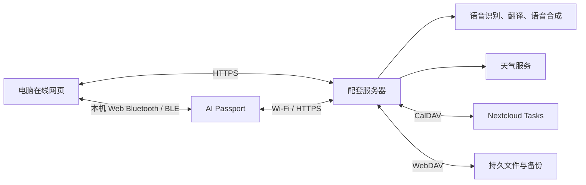

[English](passport-suite-plan.md) · **简体中文**

# AI Passport 多合一固件规划

更新时间：2026-10-05，Asia/Shanghai。状态：已按用户最新要求调整功能范围；以下技术方案仍为设计草案，尚未开始应用编码。

目标是一份包含五项功能的多合一固件，配套电脑访问的在线管理网站。电脑网页通过蓝牙连接附近的设备，设备使用自身 Wi-Fi 访问服务器和在线服务。日常使用不依赖手机，不开发手机应用，也不把手机热点或手机配网作为必需步骤。

用户决定范围和验收要求；Codex 负责需求、架构、评审与验证，OpenCode 在获准的实施阶段编码。工程要求遵循 [AGENTS.md](../../AGENTS.md) 和 [AI 开发指南](../development/ai-guide.zh_CN.md)。

## 1 最新功能范围

| 原需求编号 | 调整后的功能 | 已确认安排 |
| --- | --- | --- |
| 1 | 随行语音翻译 | 保留并继续详细设计；首版中文 ↔ 英文；语音/AI 服务待定 |
| 2 | OTP 验证码应用 | 保留并继续详细设计；取消原来必须最后才设计的限制 |
| 3、7 | 随行票夹，含铁路信息 | 合并为一个应用；展示车票、机票、演出票等票面信息，支持原始有效二维码；取消车站大屏和无车票出发列表 |
| 4 | Nextcloud 待办 | 必须完成真实待办列表连接、读取和设备显示；设备读取列表并可标记完成；新增任务不纳入当前范围 |
| 8 | 三体时钟和天气 | 保留；完成后作为默认首页 |
| 5、6、9、10、11、12 | 额度显示、编程助手控制、随行导游、中国打卡、QQ 音乐、PPT 翻页器 | 全部取消，不再作为延后事项，也不设计占位入口 |

取消与导游、打卡相关的路线生成、景点讲解、省份包、全国地图、印章、足迹、成就和心愿单。它们的资源、数据模型、接口、阶段及验收不再属于当前产品。票夹不扩展为导游或打卡应用。FIDO2、Passkey、U2F、密码库和 SSH 签名仍不在范围内。

## 2 连接方式与分工

| 通道 | 设计用途 |
| --- | --- |
| 电脑网页 ↔ 设备 BLE | 首次配网、设备绑定、少量设置和状态；OTP 导入使用独立受保护会话，不能直接沿用普通设置写入权限 |
| 设备 Wi-Fi ↔ 服务器 | 票据下载与同步、Nextcloud 待办、天气、校时、翻译音频及结果；无需电脑常开 |
| 电脑网页 ↔ 服务器 | 票据导入审核、任务连接设置、翻译语言及服务设置、设备管理和备份状态 |

蓝牙由访问网页的电脑连接附近设备，远端网站服务器不能直接连接用户设备的蓝牙。网页必须通过 HTTPS 提供，在用户点击连接后申请设备权限；电脑必须有可用蓝牙和支持 Web Bluetooth 的浏览器。[Chrome 官方说明](https://developer.chrome.com/docs/capabilities/bluetooth)列出平台差异，Linux 可能需要启用实验设置。先实测实际电脑、操作系统、浏览器版本及重连行为，再确定支持矩阵；不能默认所有浏览器均可连接。

本设计选择浏览器 BLE GATT 会话，不将已有 BLUFI 示例直接视为可用网页客户端。自定义服务 UUID、消息分片、大小限制、应答、超时、取消和版本兼容规则需重新详细设计。配网仅在设备实体确认后限时开放；敏感配置要求认证和保密，不能依赖设备名称、UUID 或浏览器授权作为设备认证。错误密码、断连和取消不得破坏此前可用配置。设备验证服务器身份后完成绑定，凭据支持撤销；TLS 时间初始化不得通过关闭证书验证解决。

Wi-Fi 与 BLE 的共存方式遵循 [ESP-IDF 5.5.3 共存文档](https://docs.espressif.com/projects/esp-idf/en/v5.5.3/esp32c3/api-guides/coexist.html)。建议完成设置后关闭 BLE 或限时启用，大下载与语音不并发；这些是待实测策略，不是吞吐或内存保证。浏览器 BLE 不可用时需评审另一种电脑配网方式，不回退到手机依赖。

原有服务器 WebDAV 持久存储和备份要求继续保留，但缩减为票据、设置、待办缓存及独立加密 OTP 备份，不保存已取消功能的数据。Nextcloud 待办使用 CalDAV，不能用 WebDAV 文件备份替代任务协议。服务地址和凭据在运行时私下配置。

## 3 随行票夹（合并铁路信息）

网页支持手动录入和粘贴文本，后续评估截图或文件识别。所有疑似字段须审核后发布；OCR 不是首版已完成能力。设备提供按日期排列的票据列表、票面详情和独立票码页，已完整下载的票据断网可查看。

| 票据类型 | 必需显示的信息（来源提供时） |
| --- | --- |
| 火车票 | 乘车日期、车次、上车站、下车站、出发/到达时间、车厢、座位或无座、席别；用户上车站与列车始发站区分 |
| 机票/登机牌 | 日期、航班、出发/到达机场及航站楼、出发/到达时间、座位；登机口和登机时间只显示有来源的信息及其更新状态 |
| 演出票 | 演出名称、场馆、场次日期时间、区域、排、座位；站票明确标注 |
| 其他票据 | 名称、票种、有效期、场所或地址、入场说明、来源提供的座位，以及二维码或条形码 |

共同字段包括稳定票据 ID、版本、时区、票种、来源、审核状态、最后更新、缺失字段原因和票码可用状态。跨午夜和跨时区时间携带完整日期；不使用缺省值冒充真实座位、车站或登机口。

取消车站大屏、全站出发列表、实时检票状态与大屏数据源调查。原计划的途径站、停站时间和车型不作为新范围的必需验收项；如以后需要再单独确认。个人票面可靠信息不依赖实时铁路接口。

只展示发行方提供的原始票码内容或经验证的原图，不把订单号、座位或车次自行拼成通行码。铁路信息页不意味着可以替代身份证或官方乘车凭证。支持能有效缓存的静态二维码或条形码；动态、短时、身份绑定码须先核实发行方规则，不能承诺离线通行。没有有效码时显示原因，保留详情。

票码页保留静区、整数缩放和屏幕安全边界，停止无关动画；需要真机扫描及实际票务规则验证。浏览票据或展示票码不自动表示已核销。票据删除和缓存清理分开，同步错误不覆盖当前可用票据。

## 4 随行语音翻译

首版设计为手动进入翻译页、选择源语言/目标语言、按键录制短句、发送、显示译文并可播放合成语音。自动检测源语言、双向快捷切换及历史保留作为待评审选项。首版为中文 ↔ 英文双向翻译，服务商尚未确定；其他语言不纳入首版。

设备通过自身 Wi-Fi 将有上限的音频发送到服务器，由服务器适配识别、翻译和合成服务；不经手机转发。离线时明确无法发起新翻译，不承诺本地完整语音识别或翻译模型。录音、请求和播放均可取消，超时和服务失败提供明确状态，不自动连续录音。

详细设计需确定录音上限、格式、流式缓冲、返回文字长度、播放方式、费用及音频保留策略。源文和译文分别显示；选择语言前验证字形覆盖与中文字体。录音手势与全局返回手势分开定义。

## 5 OTP 验证码

本轮开始详细设计，不再等待其他功能全部完成。建议先以 TOTP 为基础；算法、位数、周期及是否支持 HOTP 按实际账户兼容性确认。设备本地生成验证码，正常离线使用；时间不可信时提示校时，不能伪装成可用验证码。

导入流程建议在电脑网页本地解析标准 OTP URI 或二维码，展示发行者、账户、算法和参数，再通过受保护 BLE 会话写入设备，并要求实体确认。导入页面避免第三方脚本，不默认上传明文种子到服务器；详细设计仍须明确如何验证设备身份、保护传输和清理浏览器临时数据。

确定解锁方式、闲置锁定、种子存储、时间漂移、加密备份、恢复、删除和升级保存策略后才能引入真实种子。独立加密 OTP 备份可沿用 WebDAV 存储，但不得混入普通票据导出；恢复材料不能只保存在设备上，备份访问不能仅依赖这台设备生成的 OTP。先用公开测试向量和虚构账户验收，不在源码、日志、截图或测试样本写入真实种子。硬件安全配置及 eFuse 写入另行评审。

## 6 Nextcloud 待办

必须完成真实连接，而不是仅展示样本列表。服务器保存 Nextcloud 连接配置，通过 CalDAV 发现并读取支持任务的集合，将有上限的任务列表同步到设备。[Nextcloud Tasks 官方说明](https://github.com/nextcloud/tasks)列出 CalDAV 同步方式及 ETag 冲突处理要求。

必需行为包括选择列表、显示标题、完成状态、到期日和可用备注，显示最后同步时间、手动刷新、空列表、认证失败及缓存过期状态。离线保留已下载任务，并标记缓存；“服务器已连接”和“设备已下载”分开显示。正确处理全天日期、时区、无到期日及长文本。重复任务、子任务及共享列表兼容性需用实际 Nextcloud 版本验证。

设备标记完成为必需：用户选择任务并明确确认后保存操作，显示待同步、成功或失败；断网操作持久排队，重启后继续重试。必须定义任务 UID、ETag 条件更新、幂等重试和冲突界面，不能覆盖网页端较新的修改。恢复未完成待另行确认；新增任务和语音创建不纳入当前范围。

## 7 三体时钟和天气及交互

三体时钟完成后为默认开机首页，显示三体风格动态场景、日期、时间、指定城市天气和功能入口。使用有上限的程序绘制；时钟不可信和天气过期分别提示。天气失败不阻止显示本地时间或进入其他功能；城市可在电脑网页设置，字体、帧率、休眠和耗电待真机验证。

功能选择页只包含翻译、OTP、票夹、待办以及设置/同步。设置页承载配网、绑定、城市、语言和设备状态，不恢复已取消功能入口。应用重新设计 UI，不使用基线测试菜单或演示外壳。

设备使用上下和确认三个按键，不依赖同时按键。列表上下移动、确认打开；长按确认建议进入包含返回的操作菜单。翻译录音页使用明确独立手势；票码确认返回详情。详细 PRD 要逐页定义短按、长按、松开、取消和返回。按钮回调非阻塞，跨任务 LVGL 操作持锁；页面删除前停止所有能访问它的任务和回调。

## 8 资源、同步与数据保存

目标硬件仍为 ESP32-C3、8 MB Flash、无 PSRAM、ESP-IDF 5.5.3。删除省份包、讲解和地图预算，旧 D1 的 5 MiB 应用与双资源槽方案不再作为当前存储设计依据；先测应用、字体、票码缓存、音频缓冲和 BLE/Wi-Fi/TLS 峰值，再确定应用专用分区。上游默认分区表保持最小布局。

票据和缓存版本在完整校验后启用，失败保留旧版本；限制导入、网络响应、票码和音频大小，避免整文件入 RAM。服务器在可靠保存记录和上传队列后确认同步，将设备本地保存、服务器接收、WebDAV 备份完成分开显示。备份支持空白实例恢复，OTP 使用独立保密和恢复流程。实际保留数据的刷写方案需在实施阶段明确。

## 9 后续设计与验收

2026-10-05 的[五合一 PRD](passport-suite-prd.zh_CN.md)、[协议](passport-suite-contract.zh_CN.md)及[阶段提示词](passport-suite-prompts.zh_CN.md)已将此范围展开为页面、协议和重编任务。新增工作以 SU/SC/ST/SA 编号为准；下表只是工作块概览，不构成另一套任务顺序。翻译与 OTP 详细设计同步交付，实现按各自门槛推进，不规定 OTP 最后。

下表为建议工作顺序，不是工期承诺或编码授权。翻译与 OTP 的详细设计现在即可开展，不等待旧旅行阶段。

| 工作块 | 设计交付 | 验收重点 |
| --- | --- | --- |
| 连接基础 | 电脑浏览器支持矩阵、BLE 安全会话、配网/绑定协议、Wi-Fi HTTPS、校时和资源预算 | 实际电脑配网；错误口令、权限拒绝、超时、断连、重连、共存及重启 |
| 五项功能详细设计 | 逐页 UI/按键、翻译服务与语言、OTP 安全方案、票据字段及 Nextcloud 读取/标记完成协议 | 五项范围完整，已取消入口和依赖不存在 |
| 票夹与待办 | 导入审核、票据同步、CalDAV 真连接、离线缓存 | 火车/飞机/演出票缺字段及跨日；票码扫描；真实任务读取、标记完成、离线重试及并发冲突 |
| 时钟与天气 | 默认首页、天气源、城市设置、时间状态 | 重启首页、天气过期、长时间运行及功耗 |
| 翻译 | 有界录音、识别/翻译/合成、取消及字形 | 实际语言服务、播放、失败、超时及断网 |
| OTP | 本地生成、受保护导入、解锁、加密备份与恢复 | 测试向量、错误时间、断网、错误恢复材料及无原设备恢复 |
| 整体验证 | 主机测试、完整仓库门禁和真机混合使用 | 内存、栈、任务退出、数据保留和连接切换 |

当前只有规划文档变更。功能、外部服务、BLE 安全、扫码、OTP 安全、资源容量和设备运行均未验证。开发前检查五项必需技能可用；实际固件交付分开报告 Build、Host tests、Device tests 和 Unverified，并按仓库要求主动提供获准后的设备测试。

## 10 旧文档处理

2026-10-03 的[旅行 PRD](passport-travel-prd.zh_CN.md)、[数据约定](passport-travel-contract.zh_CN.md)、[OpenCode 提示词](passport-travel-prompts.zh_CN.md)和 [D0 评审](passport-design-review.zh_CN.md)仅保留为历史记录，已被本次范围调整替代，不再是实施依据。旧 D1—D9 阶段、SoftAP/手机配网、导游打卡协议及验收号不可直接沿用。可复用工程原则需重新纳入当前五项功能设计后使用。
