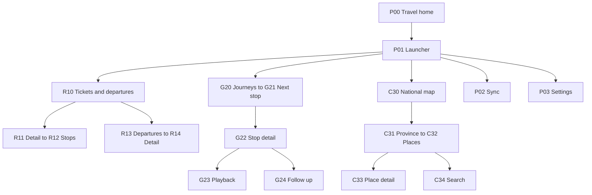

[简体中文](passport-travel-prd.zh_CN.md) · **English**

# AI Passport First Travel Feature Requirements

> **Superseded (2026-10-05):** Historical reference only, no longer implementation or acceptance authority. The [integrated firmware plan](passport-suite-plan.md) retains translation, OTP, the merged wallet, Nextcloud tasks and the three-body clock/weather; other features are cancelled. Do not execute old stages, phone/SoftAP provisioning proposals or implementation prompts directly.

Updated: 2026-10-03. Status: D0 design deliverable for review; implementation is not authorized. Readers are the product owner, OpenCode implementer and Codex reviewer. This document makes the railway, guide, check-in, website, server and WebDAV requirements in the [overall plan](passport-suite-plan.md) actionable. See the [version 1 contract](passport-travel-contract.md) and [OpenCode stage prompts](passport-travel-prompts.md).

## 1 Scope and design decisions

User decisions: one integrated firmware; railway, guide and check-ins first; province downloads on demand; server program and website; Linux and Docker Compose deployment; WebDAV persistence; three-body clock becomes the default home once implemented; OTP is designed last with seed backup recoverable after device loss. Quota display, assistant control, QQ Music, presentation remote and FIDO are outside this design.

Proposed defaults below require review and are neither confirmed user choices nor measurements: private single-user deployment; a server SQLite working database and file cache; browser management; device Wi-Fi and HTTPS synchronization; fictional Jiangsu fixtures; a local SoftAP provisioning website. Check framework/dependency versions before implementation; no unverified software version is prescribed here.

D1 implements a new UI, provisioning/binding, a small pack, persistent events, website synchronization and WebDAV recovery foundations. D2 implements railway, D3 guide and audio prototypes, and D4 check-ins. Each increment is runnable on its own branch and shares the data contract. D1 fixture viewing and completion controls are not finished guide/check-in applications.

Do not assume real railway access, dynamic font loading or live speech/AI requests before acceptance. Cached text is fundamental; cached audio is a mandatory D3 acceptance capability. An optional audio reference in a schema must not become a permanent substitute for offline narration. D3 separately verifies voice follow-up connectivity, limits, cancellation and responses without affecting offline browsing.

## 2 One complete user flow

1. Deploy the server, log into its website, configure WebDAV privately and test directory access and recovery.
2. Enter device provisioning, connect a phone to the temporary device hotspot, then enter the 2.4 GHz network and server HTTPS address on its local website. Store credentials privately.
3. Create a short-lived binding request on the server website and enter its code on the local provisioning page. The connected device requires physical account confirmation. Network, server authentication and binding states remain distinct.
4. Import and review tickets, review guide routes, select province resources and publish revisions. Synchronize the device, inspect sizes and confirm download.
5. Activate only after complete verification. Offline, view railway fields, the next stop and narration; record a visit or wish locally before reporting success.
6. Reconnect and upload pending events. The website distinguishes server receipt from WebDAV backup. Removing resources frees space without deleting history.
7. Restore an empty server from a complete WebDAV snapshot and rebind devices. Do not automatically reactivate old device tokens during recovery.

An unreachable server does not prevent existing offline content. A newly initialized device without packs still has national summaries, settings and explicit empty states.

## 3 Screens and layout

Design a new travel UI; do not inherit the demo menu or `ui_pixel` visual shell. Proposed 240 by 320 layout: 28-pixel status and action-hint strips, a central content region and 12-pixel side margins. Rounded-screen safety needs hardware inspection. Start with 16-pixel body text and 20-pixel titles as candidates, loading only required page content.

| Page ID | Content and main action | Entry and return |
| --- | --- | --- |
| P00 | Travel home: current journey, next train/stop, pending count | Boot; OK opens launcher. Clock replaces it later while retaining travel entry. |
| P01 | Launcher: railway, guide, check-ins, sync, settings | P00; cancel returns home |
| P02 | Sync center: Wi-Fi, binding, server, pack states, event count, backup states | P01; confirm selected actions, menu returns |
| P03 | Settings: provisioning, server binding, clear network, manage caches | P01; confirm destructive actions separately; no general full-chip erase |
| R10 | My tickets sorted by travel date with train and stations | Railway entry; separate station-departures option |
| R11 | Ticket detail: date, train, carriage, seat, boarding/arrival stations, departure, optional model | R10; OK opens stops; menu provides Back and provenance |
| R12 | Stops: station, dated local arrival/departure, dwell minutes, traveled interval | R11; browse stops/sections, keeping origin distinct from boarding |
| R13 | Departures: configured station/date, data category, source freshness, trains | R10; configure stations/dates on website first and select from configured choices |
| R14 | Departure detail with fields actually supplied by source | R13; identify scheduled data as a timetable rather than a live board |
| G20 | Downloaded journeys with revision, integrity and progress | Guide entry; OK opens route |
| G21 | Next stop: name, position, summary, completion/audio state | G20; UP/DOWN change stop, OK opens details |
| G22 | Stop detail: text, opening-time reminder, play, complete, ask, Back | G21; select actions; text can paginate |
| G23 | Playback: narration, progress, pause/resume, stop | G22; Back stops playback and waits for stop acknowledgement |
| G24 | Voice follow-up: hold to record, release to send, waiting, answer, cancel | G22; appears only in the authorized connected-speech increment |
| C30 | National map: 34 province-level regions, visited count and province focus | Check-in entry; UP/DOWN select, OK enters; map/list share focus |
| C31 | Province: pack size, revision, coverage, download/update, cities | C30; show unavailable downloads when disconnected |
| C32 | Place lists: cities, counties, attractions, search, daily and selected items | C31 or child pages; explicit parent entry |
| C33 | Place detail: visited, wish, description, stamps | C32; only confirmed save actions change records |
| C34 | Initial search: letter choice, query and results | C32; menu offers delete letter, clear, results and Back |
| C35 | Stamp album, footprints, wishes, achievements, daily item | C30 menu; explicit empty and missing-resource states |
| P04 | Action menu: Back, sync and page-specific actions | Long OK; Back to parent is first; Close is last and restores current-page focus |

Page relationships:

## 4 Button events and cancellation

Propose application events `PRESS`, `RELEASE`, `CLICK`, `HOLD_START` and `REPEAT`. Long OK starts at 700 ms; release after a hold never also produces a click. UP/DOWN move once initially, repeat every 180 ms after 450 ms, every 90 ms after 1.5 seconds and every 60 ms after three seconds. These timings are candidate targets. Ordinary lists stop at boundaries; the letter selector may wrap.

Long OK normally opens P04. G24 is an explicit exception: its prompt says hold OK to speak and release to send. In the idle capture state short OK sends nothing; a hold starts capture and release submits. Short UP cancels the current attempt and clears buffers; short DOWN returns to G22. At ten seconds capture stops into a send-confirmation state: short OK sends, UP cancels and DOWN returns. Release of the original hold after automatic stop does not send. Stream rather than buffering a large recording in RAM. Before entering G24, long OK still opens the menu, separating voice from Back. Verify on hardware in D3.

C34 separates letter and result modes. UP/DOWN choose a letter, OK appends it; a menu action opens results, where UP/DOWN select and OK opens. Menu actions delete a letter or return to letter mode. Limit the query to eight ASCII letters; no full Chinese keyboard is required. Show the current-province scope and the result's city to distinguish duplicate names.

G22 defaults to its action list. Read narration enters an in-page text mode: UP/DOWN paginate, short OK returns to actions and long OK still opens P04. G23 playback actions are pause/resume and stop, selected with UP/DOWN and executed with OK. Network/download cancellation first requests worker shutdown, then returns after acknowledgement while retaining existing usable resources. Stop tasks, callbacks and timers that can access a page before deleting it. Busy pages must accept cancellation without stacking requests.

## 5 Railway requirements

| ID | Required behavior |
| --- | --- |
| R01 | Website manual entry and pasted-text import first; uploaded screenshots/documents can await manual extraction. OCR is a later adapter and must not report false recognition success. |
| R02 | Field provenance and review state; confirm missing/suspect fields before publication, with explicit missing values allowed |
| R03 | Display required ticket fields and correctly handle cross-midnight travel, intermediate boarding and standing-seat text |
| R04 | Identify scheduled versus actual times, calculate nonnegative dated dwell time and mark the traveled interval |
| R05 | Show model only with verifiable provenance; no inference from G, D or other prefixes |
| R06 | Without a ticket, show configured station departures; distinguish scheduled listings and live boards |
| R07 | Show fetched time, staleness and unavailable sources explicitly; never invent trains as a live response |

Live-source investigation remains open; D0 has no actual accounts or samples.

| Field | Expected source | Evidence and treatment |
| --- | --- | --- |
| Stations, train, date, seat, carriage | User-supplied 12306 material with review | Fictional fixtures only; sanitized real formats remain unverified |
| Stops, dated arrival/departure, dwell | Permitted timetable interface or supplied data | No provider selected; validate model with labeled fixtures |
| Train model | Date/train-matched source explicitly containing the model | Unverified; keep missing |
| Platform, gate, boarding state, delay | Actual station-board source | Unverified; timetable success cannot satisfy live-board acceptance |

D2 may deliver import/cache behavior with live access separately unverified; that does not make the entire railway requirement complete. Before implementing automated retrieval, inspect interface permission, authentication, rates and fields rather than assuming a stable public API.

## 6 Guide requirements

| ID | Required behavior |
| --- | --- |
| G01 | Website destination, dates, available duration and companion constraints; manual routes work first, AI drafts use an available provider later |
| G02 | Separate draft, reviewed and published states; regeneration creates a new draft |
| G03 | Server stores multiple journeys; website selects downloads, device retains selected revisions within capacity |
| G04 | A three-to-five-stop fixture with text and audio; fully offline browsing, playback, pause and cancellation |
| G05 | Manual completion/undo and progress; stable stop IDs preserve progress across publication, deleted stops retain history |
| G06 | Connected follow-up uses selected route/stop context with timeout/cancel, never replacing reviewed routes |
| G07 | Opening times have provenance and freshness; no automatic GPS/arrival promise or guarantee of real-time AI opening advice |

The first audio prototype uses a maximum 15-second mono 16 kHz, 16-bit PCM sample, at most 480,000 raw bytes. This verifies the playback path rather than full narration capacity. D3 measures CPU, RAM and quality to choose compression before freezing audio capability. If unsuitable, revise and review the design rather than silently dropping offline narration.

## 7 Check-in requirements

| ID | Required behavior |
| --- | --- |
| C01 | Resident national map and 34 province-level identifiers; readable regions and map material review get separate acceptance |
| C02 | Select provinces on device or website; show coverage, size, revision and staging needs; failure preserves old packs |
| C03 | Browse packaged hierarchy and reviewed initials; device does not guess polyphonic names |
| C04 | Visited and wish are independent; persist before success/stamp feedback, retaining records after resource updates/removal |
| C05 | First city visit creates its stamp and short animation, surviving power loss/restart |
| C06 | Attraction visits contribute to cities, city visits to provinces; undo the last contribution recalculates summaries while direct city visits still count |
| C07 | All 34 provinces with effective visits unlock the national achievement; undo can remove current eligibility while retaining historical unlock |
| C08 | Daily/selected items, album, footprints, wishes, achievements/settings; offline candidates require a known date rather than fabricated daily content |

City stamps distinguish current eligibility and historical acquisition. Undoing the last city contribution dims the map while preserving a marked historical stamp. Retried events never restamp; a renewed confirmed visit may replay feedback without duplicating history. Stable place IDs keep records independent of downloaded packs. Direct province visits would need a separate definition; initially city/attraction contributions light provinces. A city can be visited and wished-for again, with independent labels explained on the website. ID changes require mappings or preserved historical records; names are not unique identities.

## 8 Website and server requirements

| ID | Page or service | Behavior |
| --- | --- | --- |
| W01 | Login and initialization | Private single-user account; controlled deployment initializes admin, no public unauthenticated bootstrap |
| W02 | Journey workspace | Ticket import/review, route editing, revision publication, multiple journeys; invalid required fields block publication |
| W03 | Resource workspace | Province choice, preparation/publication, sizes and device capacity; queued work is not downloaded |
| W04 | Footprints/progress | Visits, wishes, corrections and conflicts; last-known sync and offline state, not live location tracking |
| W05 | Devices | Binding creation, identity confirmation, credential revocation/rebinding; revocation does not remotely erase offline content |
| W06 | Storage/backup | WebDAV configuration/test, upload queue, snapshot revisions, last complete backup, private export, empty-server restoration |
| W07 | Failures/recovery | Local/DAV quota failures, retries and recovery material; preview revision before restoring, do not overwrite current database |
| W08 | Future OTP | Only reserve a separately encrypted backup type in design; implement last, without real seeds, misleading UI or success states |

Proposed future location: `companion/passport-server/` in the same repository, containing server, website and resource jobs. Review repository checks/test entry points before adding it; no project is created now. SQLite uses a local persistent volume and WebDAV separate directories. Deployment has Web/API, resource workers and volumes; a reverse proxy or application terminates TLS. Document upgrades, backups, permissions and recovery. Real deployment requires separate authorization.

The website supports phone and desktop layouts, initially targeting a 360-pixel minimum viewport. Verify actual Android Chrome and desktop browsers, recording versions at execution; do not promise all-browser compatibility. Configure addresses and secrets privately, outside demonstration screenshots.

## 9 Connectivity and provisioning

D1 proposes a time-limited SoftAP website without browser BLE. Open the temporary hotspot only after physical confirmation, generate a per-session password, show the local address and stop after five minutes or cancellation. Accept settings only in the local provisioning session; bound request sizes/rates/origins and protect against cross-site requests. The remote server website does not automatically control the local device across origins. Never log SSIDs/passwords; stop provisioning after success and retain prior usable settings until the replacement connection is verified.

SoftAP is a new application capability. The [ESP-IDF 5.5.3 provisioning documentation](https://docs.espressif.com/projects/esp-idf/en/v5.5.3/esp32c3/api-reference/provisioning/wifi_provisioning.html) provides SoftAP and BLE transports; a website client and security handshake are not baseline features. Before implementation, choose a provisioning manager plus compatible client, or a restricted application settings service, and document authentication/confidentiality. Do not copy password-logging examples. If actual browser provisioning fails, review BLUFI mini-program fallback rather than silently requiring a native application.

The authenticated server website generates a proposed five-minute, single-use binding code with limited attempts; review its length and randomness during security design. The device authenticates the HTTPS server, exchanges the request, displays the account label and requires physical confirmation before receiving scoped revocable credentials. Hotspot passwords, binding codes and device tokens are distinct. Verify hostname and trust chain. Propose user confirmation of browser-supplied date/time on the local provisioning page, marked user_set for initial TLS validation. Subsequently obtain server_time from the authenticated server. Implausible time or invalid certificates stop connection and prompt correction rather than bypassing validity. Verify bootstrap in D1; it does not settle final OTP time trust.

Manual synchronization is the default proposal. Poll at most once per 30 seconds on the active sync page, stop while asleep and back off failures. Defer large downloads during audio. Contract timeouts/buffers remain subject to measurement.

## 10 Offline and persistence states

| Condition | Device behavior | Website/server behavior |
| --- | --- | --- |
| No Wi-Fi/unreachable server | Cached content, visits and route progress persist; follow-up explicitly unavailable | Last-known sync, not a claim that new publication reached the device |
| Interrupted/invalid download | Old pack remains active, new one inactive; cancel/retry | Preserve immutable revision and show failure/queue |
| Locally saved event without acknowledgement | Pending count increases and survives reboot | Do not show synchronized before receipt |
| Durable server receipt, failed DAV upload | May clear acknowledged queue, while reporting remote backup pending | Persist records and upload jobs; remote durability is incomplete |
| DAV outage/quota | Existing device content works; uncached remote resources may fail | Local queries continue with backoff; reject new unsavable content if local storage also fills |
| Empty-server restore | Retain offline records; compare differences after rebinding | Validate complete snapshots in a new instance; pending uploads are absent from that backup |
| Lost device | Restore existing backups; unsynchronized records may be lost | Revoke device token; future OTP uses independent recovery material, with account seed replacement if needed |

Removing caches and deleting records are separate actions with explicit consequences. Conflict resolution is not merely latest device time. Unbinding does not erase content or invalidate OTP seeds. Approve migrations and flash preservation before storing real records.

## 11 Fixtures and resource prototypes

The sample is `fixture-js-trip-001`, with province ID `CN-JS`, a Suzhou city label, a fictional test district and an attraction labeled with U+752A for glyph testing. All are functional fixtures rather than a verified administrative directory, attraction listing or travel recommendation. The resident national structure remains; D1 downloads a small fixture, D4 accepts province interactions. Every fixture UI shows test-data status.

Fictional train `TEST-001` originates at sample station A, boards the user at B on 2026-10-03 at 23:58, reaches C on 2026-10-04 at 00:20 and leaves at 00:25, then arrives at D at 01:00. Fixture carriage 02, seat 03A, unknown model; dwell at C is five minutes. This tests cross-midnight/intermediate boarding and is not a real train.

Guide stops `stop-001` through `stop-003` use fictional narration and a sample no longer than 15 seconds. One city, one county and three attractions include initial/glyph negative tests. These descriptions are not already generated runnable packs/audio. Generate actual digests and glyph inventories during implementation; fake hashes must not bypass verification.

D1 measures pack/app size, minimum heap, largest block, stacks, TLS peak and post-exit baseline. D3 adds decode/feed timing. Retain overall tentative Flash categories without writing a partition table now. Cap the D1 fixture at 768 KiB subject to preflight. The contract proposes an experimental 5 MiB app, 128 KiB records NVS and two resource FAT slots totaling 2.8125 MiB. This is a D1 prototype layout, not a changed partition table or final-capacity guarantee.

## 12 Acceptance matrix

All rows are currently NOT RUN. D0 verifies design consistency only. H means host/contract tests, E means actual end-to-end integration, D means physical-device observations.

| Acceptance ID | Requirements | Passing evidence | Stage |
| --- | --- | --- | --- |
| A01 | Screens/keys | H hold suppresses click and repeat is bounded; D every Back/cancel path, new UI and readable text | D1 to D4 |
| A02 | Provisioning/binding | H expired/replayed codes rejected; D phone-browser provisioning, wrong password, cancel, reboot and HTTPS request | D1 |
| A03 | Resource activation | H traversal, oversize, digest/glyph failures rejected; D interruption, insufficient space and power loss preserve old pack | D1 |
| A04 | Local records | H deduplication/persistence model; D power loss after save retains record, failed save never stamps success | D1, D4 |
| A05 | Conflicts | H retry without duplicate, stale versions do not overwrite; E simultaneous website/device corrections can be resolved | D1, D4 |
| A06 | DAV backup | H retry and incomplete snapshots never published; E actual DAV outage/reconnect and empty-server restore | D1 |
| A07 | R01 to R04 | H intermediate boarding, midnight, five-minute dwell/missing fields; D complete ticket view offline | D2 |
| A08 | R05 to R07 | E actual source/freshness; absent provider remains NOT VERIFIED, schedule is not live-board acceptance | D2 |
| A09 | G01 to G03 | H draft/publication isolation and stop-ID migration; E reviewed multiple journeys downloaded | D3 |
| A10 | G04, G05 | D text/audio after disabling Wi-Fi, pause/stop, completion/undo and reboot progress | D3 |
| A11 | G06 | E/D test speech service normal/timeout/cancel/offline/context, no route modification | D3 |
| A12 | C01 to C03 | H unique 34-region IDs, hierarchy/search; D map focus, province download, unusual glyph and accelerated browsing | D4 |
| A13 | C04 to C07 | H retries/corrections/propagation; D stamp/records survive pack removal; labeled 34-province achievement fixtures | D4 |
| A14 | C08 | H unknown date/empty candidates; D all auxiliary pages reachable with correct Back/empty states | D4 |
| A15 | W01 to W07 | H permissions, limits, token revocation; E actual phone/desktop workflows and restore preview | D1 to D4 |
| A16 | Resources/lifecycle | H cancellation/full queues in gate; D 100 heavy-page cycles, heap/stacks/shared resources, final eight-hour mixed run | Every stage and integration |
| A17 | OTP recovery | Final H/D test seeds, encrypted backup, wrong recovery credentials and no-original-device restore; requirements only earlier | D9 |

Register host and companion tests under reproducible entry points. The complete firmware gate follows repository policy; visual, sound and power acceptance remain physical checks. Mocked providers and real integration have separate evidence; contract success never implies device PASS.

## 13 D0 review and next stage

D0 delivers this PRD, version 1 contract, fixture definitions, acceptance IDs and stage prompts. Review SoftAP, fixture province, SQLite, single-user mode and resource caps. Actual ticket formats, railway providers, AI and DAV compatibility remain unverified. They do not block reviewing the flow but affect their respective acceptance.

The [D0 review record](passport-design-review.md) corrects identity, retries, UI states, snapshot scope and experimental storage. Design inspection is complete for user review, not real integration acceptance. Confirm the revised design before authorizing D1 on proposed `feature/passport-core` from exact baseline `0b9e4c81ee4421c0bac39ca3561d65a8285acd4a`. If code changes, reassess the base rather than blindly using an old commit. Later branches start from accepted integration snapshots. Codex reviews/verifies; OpenCode implements/repairs. No branch, companion project or runnable fixture is created in this design stage.
